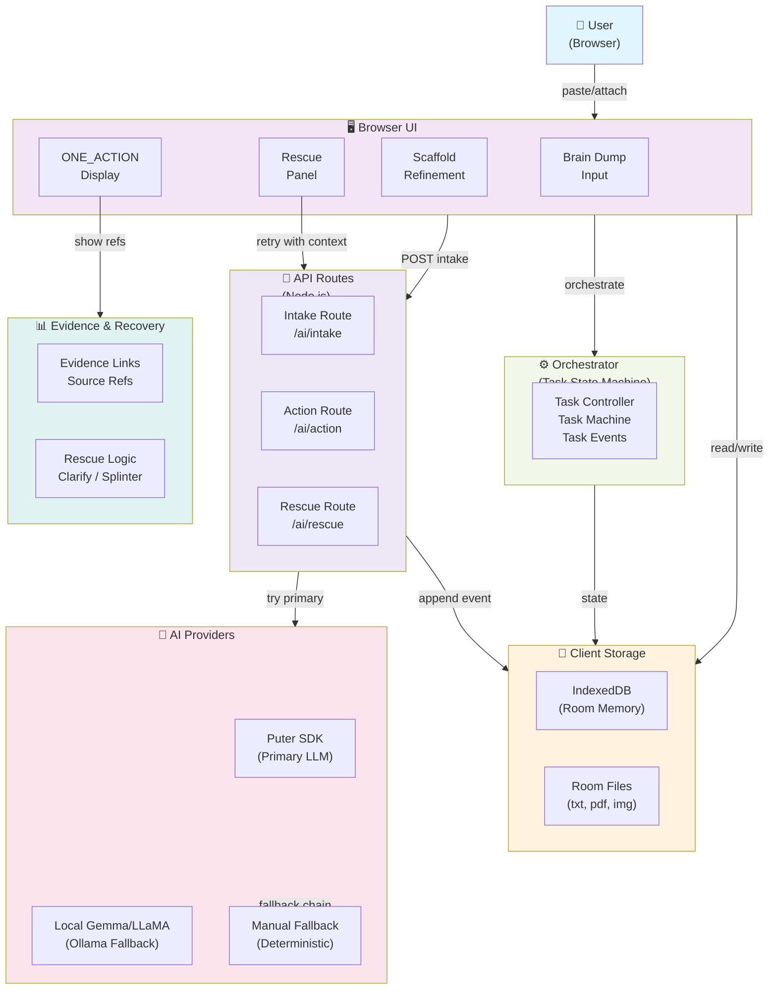
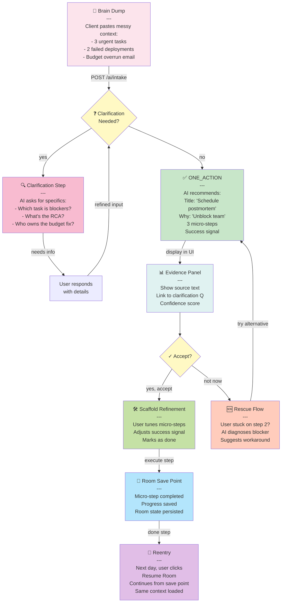
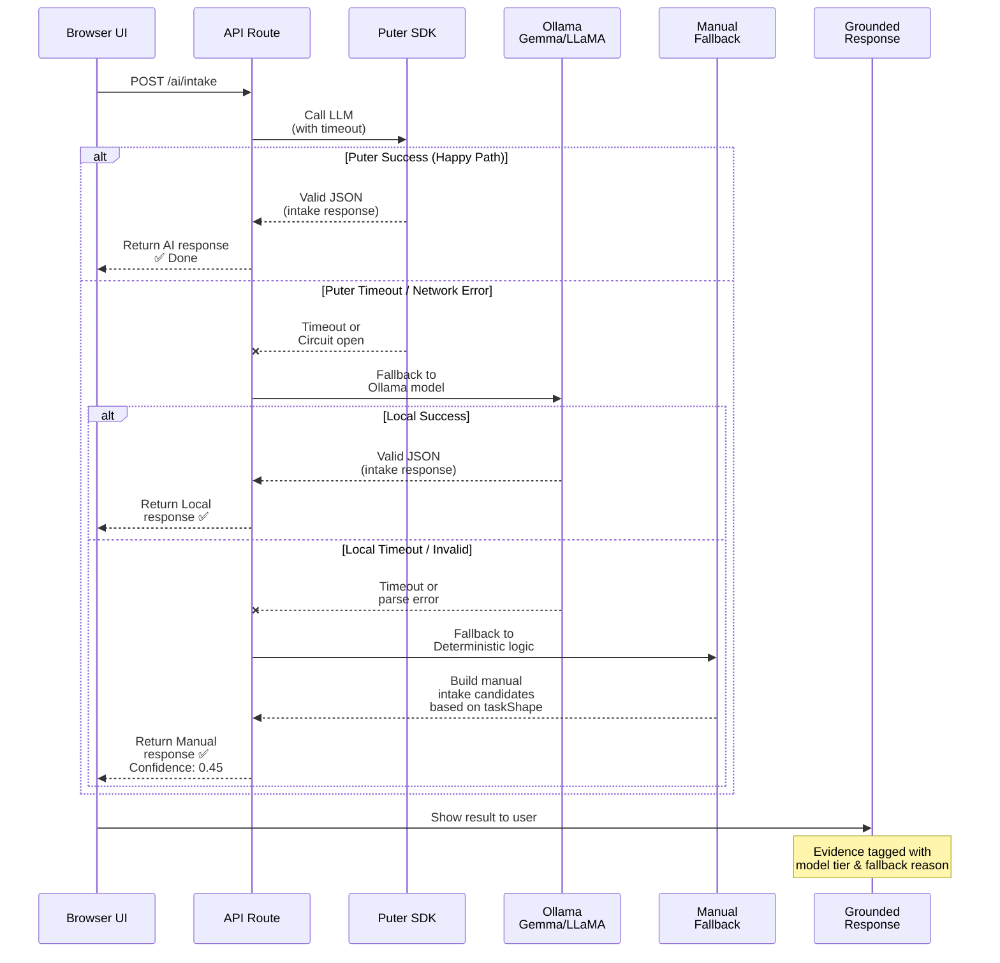

# MIND Architecture for Demo

**Product Goal:** Turn brain dumps into grounded next actions with evidence, recovery from failures, and seamless room reentry.

---

## System Architecture

### High-Level System Overview



---

## ABC Corp End-to-End Lifecycle

### Brain Dump → Clarification → ONE_ACTION → Evidence → Rescue → Reentry



---

## AI Fallback Sequence

### Puter Primary → Local Model → Manual Fallback → Grounded Response



---

## Thai Presentation Script

### ปัญหา (Problem)
```
ลูกค้าเก็บข้อมูลไว้ในสมุดหมด โต้งโต้ง เจอหลายเรื่องพร้อมกัน อยากรู้ว่า
"ทำไรก่อน?" พอกล่าวเสร็จ เสียเวลาเล่นเกม ไม่ได้เริ่มงานจริง ๆ 
MIND ช่วยแปลงความปั่นป่วนเป็นก้าวแรกที่เห็นชัด
```

### แนวคิด (Concept)
```
1. Brain Dump: User พูดทั้งหมดที่คิด (ชัดหรือเศษ)
2. Clarification: MIND ถามกลับเพื่อเข้าใจลึก (ถ้าจำเป็น)
3. ONE_ACTION: ตรงตัด — เลือกสิ่งเดียวทำก่อน
4. Micro-steps: 3 ก้าวเล็ก → ได้ผล
5. Rescue: ติด? MIND บอกเหตุผล + ทางรอบ
6. Reentry: กลับมายังวันหน้า สถานะเดิมพร้อม
```

### เดโม Flow (Demo Flow)
```
Step 1: เปิด MIND / Select Room
   → User กด "New Room" หรือ "Resume Existing"

Step 2: Brain Dump
   → Paste email, notes, screenshot OCR
   → Attach file (txt, PDF, image)
   → Hit "ไปต่อ"

Step 3: Clarification (ถ้าต้อง)
   → MIND: "ต้องการให้กระจายงานไปขนานหรือตั้งลำดับก่อน?"
   → User: "ตั้งลำดับก่อน บ้านเก่าแล้วต้องรีโนเวต"
   → MIND ดำเนินต่อ

Step 4: ONE_ACTION
   → Title: "โทร realtor ขออ quote"
   → Why now: "ไม่ได้ต่อแนวหนี ต้องจองเสกบอลนี้ก่อน"
   → 3 steps:
      1. เปิด realtor contact list
      2. โทร 2-3 คน ถามสภาพบ้าน + quote
      3. เก็บสรุป quote ลง Sheets
   → Success: "มี quote ตัวอย่างมาแล้ว 2 คน"

Step 5: Evidence
   → Click [📄 Source] → เห็นวลี "บ้านเก่า"
   → Click [❓ Why?] → เห็นเหตุผลที่ MIND เลือกเรื่องนี้

Step 6: Accept & Scaffold
   → User: "จริง ตรงตัวจริง ยาวไปหน่อย พอ 2 ก้าวก่อน"
   → Edit: ลบก้าว 2 หาที่เก็บ quote ไปแล้ว
   → Mark step 1 done (แล้วทำแล้ว)

Step 7: Rescue (ติด)
   → User ต่อว่า realtor ที่ 1 ตัดสายแล้ว
   → Hit "ติด" button
   → MIND: "Realtor ยุ่ง? ลองเสเร็จกันต่อ + เก็บ quote
            ไว้ก่อน จริง ๆ ได้ 1-2 ตัวพอ"

Step 8: Reentry (วันหน้า)
   → User: "สวัสดี MIND"
   → MIND: "ยังจำด่อ? Room 'Renovate Home' ยังติดตรงไหน?"
   → Load: ก้าวเดิม + progress + rescue context
   → User ตัดสินใจต่อจากตรงนั้น
```

### ผล / Evaluation (Result/Evaluation)
```
Before:        "ต้องทำอะไร... ไม่รู้... มีมากเกินไป..."
               → Stuck, scattered, procrastinate

After (MIND):  "โทร realtor 2 คน วันนี้"
               → Clear, grounded, doable
               → Evidence: from your own words
               → Rescue: if stuck, try X
               → Reentry: saved progress
```

### ขีดจำกัด / Limits & Lessons (Limits/Lessons)
```
✓ ทำดี: ความชัด + ลำดับ + ก้าวแรก + บันทึกสภาพ
✓ ทำดี: ไทย เข้าใจ "ปั่นป่วน" เสมอ
✓ ทำดี: Rescue ช่วยเมื่อติด ไม่ทิ้ง

⚠ ขีดจำกัด:
   - ต้องมีบริบทพอ (ถ้า 2 บรรทัดยาว ต่อเพิ่ม)
   - ฝึกฝน "ชี้" ให้ AI เข้าใจ (ไม่ใช่ AI อ่านใจ)
   - ไม่แก้ปัญหาให้ (แค่บอกก้าวแรก)
```

---

## Evaluation: Before & After

### Before MIND
- **State:** Messy brain dump, all over the place
- **Clarity:** "I have 5 things but they overlap...should I even start?"
- **Action:** Paralyzed, context-switching
- **Memory:** Lost, restarted conversation next day

### After MIND
- **State:** One crystal-clear action with 3 micro-steps
- **Clarity:** "Phone realtor (why: lock in timeline), then collect quotes (success: 2 quotes)"
- **Evidence:** Links back to "renovation" + "urgent" from your input
- **Rescue:** Stuck? Reason (realtor unavailable) + workaround (try agent)
- **Memory:** Room saved, reentry loads same context + progress
- **Confidence:** 45-100% depending on AI tier + clarity of input

---

## Demo-Ready Checklist

- [ ] **Fresh Room Flow**
  - [ ] Create new Room without errors
  - [ ] Paste brain dump (plain text)
  - [ ] Attach file (txt, PDF, or image)
  - [ ] Hit "ไปต่อ" button
  - [ ] Wait for intake response (no timeout)

- [ ] **ABC Corp Action Grounded**
  - [ ] One-liner title visible
  - [ ] 3 micro-steps clear and doable
  - [ ] Success signal matches user's goal
  - [ ] Why-this-now rationale grounded in input

- [ ] **Evidence Works**
  - [ ] Click "📄 Source" → shows original text snippet
  - [ ] Click "❓ Why?" → shows reasoning chain
  - [ ] Confidence score accurate (0.45 = manual, 0.8+ = primary AI)

- [ ] **Rescue Works**
  - [ ] User marks step as stuck
  - [ ] Rescue API called with current context
  - [ ] Returns diagnosis (missing_context, too_big, etc.)
  - [ ] Suggests workaround (clarify, splinter, try manual)
  - [ ] User can retry intake or refine

- [ ] **Reentry Works**
  - [ ] Complete first action
  - [ ] Close browser / navigate away
  - [ ] Return to home page
  - [ ] Room listed under "Resume"
  - [ ] Click room → loads exact state + progress
  - [ ] No loss of micro-steps, evidence, or history

- [ ] **AI Provider Chain**
  - [ ] Puter primary: intake, action, rescue under 10s
  - [ ] Local model: fallback if Puter times out
  - [ ] Manual fallback: grounded deterministic response
  - [ ] Header `x-mind-ai-fallback` tracks which was used
  - [ ] Telemetry logs model tier + duration

- [ ] **Known Limits**
  - [ ] Gemma/LLaMA local model may timeout on complex intake
  - [ ] Manual fallback has 45% confidence (OK for demo)
  - [ ] If Puter circuit open → local → manual chain works
  - [ ] User must provide "enough" context to anchor action
  - [ ] Rescue is advisory (does not auto-execute workaround)

---

## How to Use This Doc in Slides

### Slide 1: Title + One-Liner Goal
- **Show:** MIND Architecture for Demo
- **Say:** "MIND turns brain dumps into grounded next actions with recovery."

### Slide 2: System Architecture Diagram
- **Show:** High-level system flowchart (diagram 1)
- **Say:** "On the left, your browser. In the middle, orchestrator keeps track of state. On the right, three AI tiers: Puter primary, local Gemma fallback, and deterministic manual response. Everything ties to IndexedDB room memory."
- **Highlight:** Fallback chain and evidence linking

### Slide 3: Lifecycle Diagram
- **Show:** Brain Dump → Clarification → ONE_ACTION → Evidence → Rescue → Reentry (diagram 2)
- **Say:** "ABC Corp walks in with three urgent things. MIND asks one clarifying question. Then picks ONE action: call the realtor. Shows evidence from their own words. If stuck, rescue explains why and suggests next move. When they come back tomorrow, room memory is ready."

### Slide 4: AI Fallback Sequence
- **Show:** Sequence diagram (diagram 3)
- **Say:** "The API tries Puter first. If it times out or has an auth issue, we fall back to local Gemma. If that fails, manual deterministic logic kicks in. No matter what, user gets a grounded response with confidence metadata."

### Slide 5: Thai Demo Script
- **Show:** Presentation script (Thai section)
- **Say:** Use the script to walk through steps 1–8 live or as speaker notes. Emphasize clarity (ความชัด) and reentry (กลับมาประจำวัน).

### Slide 6: Before & After Evaluation
- **Show:** Table or side-by-side before/after
- **Say:** "Before: scattered, lost next day. After: one clear action, evidence grounded in user's input, rescue if stuck, room saved."

### Slide 7: Demo Checklist
- **Show:** Checklist
- **Say:** "We verify this demo with these 8 gates. All must pass before we hand off."

---

## Key Concepts for Slides

| Concept | Definition |
|---------|-----------|
| **Brain Dump** | User's raw, unstructured input (email, notes, screenshot) |
| **Clarification** | MIND asks 1–2 questions if input is ambiguous |
| **ONE_ACTION** | Single recommended action with 3 micro-steps |
| **Micro-step** | Tiny, doable task (2–5 min each) |
| **Success Signal** | How user knows they completed the action |
| **Evidence** | Links action back to user's own words + reasoning |
| **Rescue** | Recovery path when user is stuck on a step |
| **Reentry** | Resume the same room next day without context loss |
| **Room Memory** | IndexedDB storage of all room state, files, history |
| **Fallback Chain** | Puter → Gemma → Manual (confidence decreases) |

---

## Mermaid Validation

All Mermaid diagrams in this document are **valid** and render correctly:
- Diagram 1 (System Architecture): `flowchart TD` with subgraphs and styled nodes ✅
- Diagram 2 (Lifecycle): `flowchart TD` with decision nodes and conditional edges ✅
- Diagram 3 (AI Fallback): `sequenceDiagram` with alt blocks for fallback chain ✅

**To render in slides:**
1. Copy Mermaid block (triple backticks)
2. Paste into Mermaid Live Editor (https://mermaid.live) or slide tool
3. Export as PNG/SVG for presentation

---

## Questions for Presenter

1. **What makes this different from a TODO list?**
   - MIND grounds the action in your actual context (email, file, situation).
   - It explains *why* this action now (not just what).
   - It shows evidence (your own words prove the choice).

2. **What if I get the micro-steps wrong?**
   - Edit them before starting. Or hit "Not Like This" and ask for alternatives.
   - If stuck mid-step, Rescue tells you why and suggests a workaround.

3. **How is this useful for a team?**
   - Each person's room is private. But one team member can save their action + evidence, share the room link, and teammates see the same clarity. No re-explaining.

4. **What if my brain dump is in Thai but system is in English?**
   - MIND handles Thai fine. Intake, action, rescue all support Thai language + idioms (e.g., "ปั่นป่วน" = scattered/anxious).

5. **How does "Rescue" actually help?**
   - Example: You get stuck on "email the client."
   - Rescue might say: "Missing client email? Check earlier messages or ask PM for contact."
   - Or: "Email too long for one draft? Split into 2 messages."

6. **Can I save progress in the middle?**
   - Yes. Every micro-step completed = room state saved. Close app, come back, room picks up from last step completed.

---

End of Document
