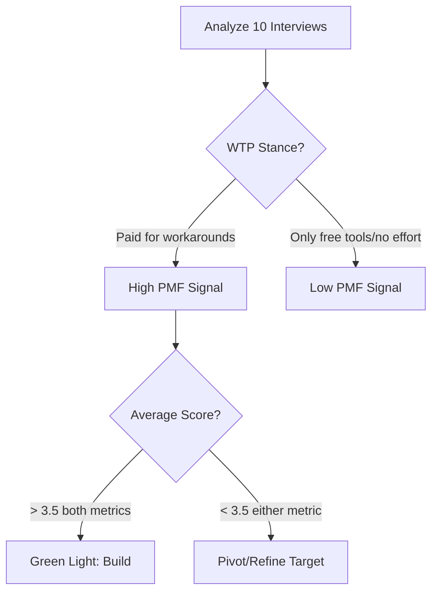

# MIND: Mom Test Interview Guide

This guide is designed to validate the real pain and willingness to pay (WTP) for solo workers, freelancers, and consultants struggling with task stalling and context overload.

---

## 1. Interview Script

### Q1: "How do you currently keep track of your active projects and tasks?"
* **Why we ask**: Understands their actual habits, workflows, and current tooling baseline without suggesting any solutions.
* **Red Flags**: Look out for hypothetical statements ("I would use...", "Usually, people use..."). Redirect to their actual setup today.

### Q2: "Can you walk me through the last time a task or project got completely stuck?"
* **Why we ask**: Anchors the conversation in a specific past event. Shows the exact point of failure (lack of clarity, missing context, fear of starting).
* **Red Flags**: Generalizations ("Tasks always get stuck because..."). Bring them back to a concrete situation: *"When was the last time that happened? Tell me about that specific Tuesday."*

### Q3: "What did you do to try and get it unstuck? How did that work out?"
* **Why we ask**: Identifies active workarounds. If they didn't try to fix it, it’s not a real problem. If they spent hours reading old emails/slacks (seeking "evidence"), you have validated a core value prop.
* **Red Flags**: Future ideas ("Next time I will..."). Focus strictly on what they actually tried.

### Q4: "How much time or mental energy did you spend trying to re-orient yourself before you could start working on it again?"
* **Why we ask**: Measures the severity and cognitive load of task reentry. Directly correlates to the value of having a "clear next action with evidence."
* **Red Flags**: Vague answers ("A lot"). Dig deeper: *"Did it take 10 minutes or did you end up putting it off until the next day?"*

### Q5: "What other tools or systems have you bought or tried to solve this problem?"
* **Why we ask**: Evaluates Willingness to Pay (WTP). If they've spent money on complex project managers, templates, or premium notebooks, they actively seek a solution.
* **Red Flags**: *"I would pay for something if..."* Compliments about your potential idea are useless; look for actual past credit card charges.

---

## 2. Pain Scorecard Template

Use this template to log and score each interviewee.

| Metric | Score / Value | Evaluation Criteria |
| :--- | :---: | :--- |
| **Frequency** | `1 - 5` | **1**: Monthly/Rarely \| **3**: Weekly \| **5**: Multiple times a day |
| **Intensity** | `1 - 5` | **1**: Annoying minor delay \| **3**: Causes stress/missed deadlines \| **5**: Leads to severe procrastination / lost clients |
| **Workarounds** | *Text* | What manual steps do they take? (e.g., searching 5 apps, re-reading old drafts, writing list of lists) |
| **Willingness to Pay (WTP)** | `Y / N / Maybe` | Have they paid for productivity/focus tools before? Are they currently paying for a workaround? |

---

## 3. Synthesis Framework (PMF Signal Scoring)

Aggregate scores from 10 interviews to evaluate the strength of your product-market fit signal.

### PMF Signal Matrix

* **Strong PMF Signal (Green Light)**: 
  * Average **Frequency** $\ge 4$ (stuck tasks occur daily/regularly).
  * Average **Intensity** $\ge 4$ (causes high mental friction/wasted hours).
  * **WTP** is **Yes** (already paying for complex note-taking, task organizers, or AI helpers).
* **Moderate Signal (Proceed with Caution)**:
  * High Frequency but Low Intensity (they get stuck, but easily get unstuck with no cost).
  * Low Frequency but High Intensity (rarely happens, but painful when it does).
* **Weak Signal (Red Light / Pivot)**:
  * Low Frequency (< 3) and Low Intensity (< 3).
  * **WTP** is **No** (unwilling to invest money or effort to resolve it).
